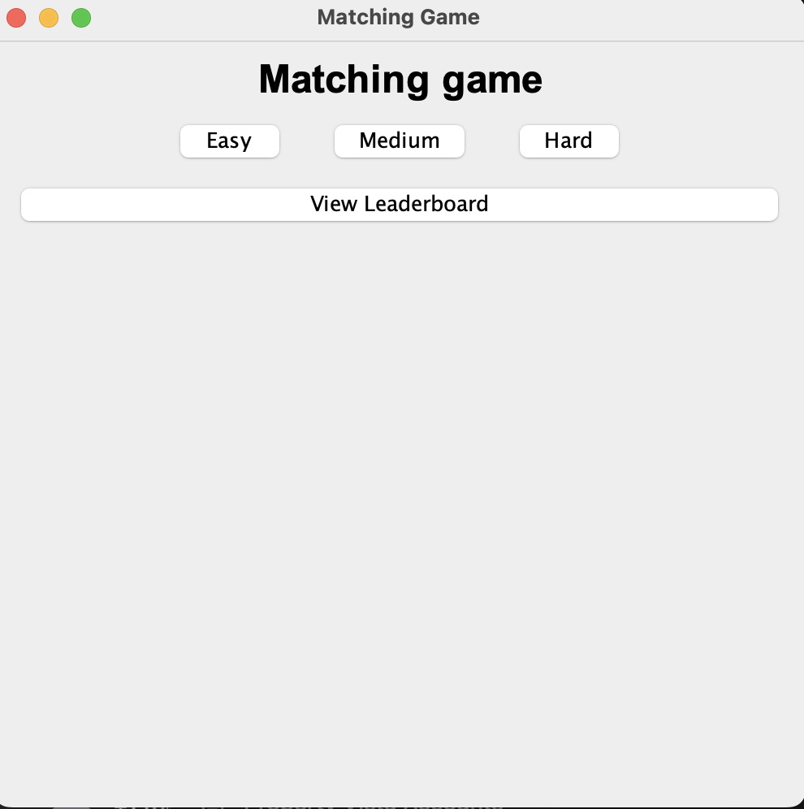

# Matching Game Tutorial

Welcome to the Matching Game! This tutorial will guide you through the steps to play the game. 

---

### **1. Launch the Game**

When you open the game, you’ll see the main menu with the following options:

- **Game Levels**: Begin a new game by selecting level.
- **Leaderboard**: View the top scores.
- **Exit**: Close the game by clicking on x button on the top on Windows or red circle on Mac.

---

### **2.  Difficulty Level**

After selecting **Start Game**, you will be prompted to choose a difficulty level:

- **Easy**: Fewer tiles
- **Medium**: Moderate number of tiles
- **Hard**: More tiles

---

### **3. Game Board**

Once you select the difficulty, the game board appears:

- It consists of a grid of tiles.
- Each tile conceals an color.
- Your task is to find and match pairs of identical colors by flipping the tiles.

---

### **4. Gameplay Instructions**

1. **Click on a Tile**: This reveals the color beneath it.
2. **Match Tiles**: Select another tile to try and find its pair.
    - If the color match, they remain uncovered.
    - If they don’t match, the tiles flip back.
3. **Score**: Your score increases with each successful match

---

### **5. Game Over Screen**

When the game ends, you’ll see the **Game Over Screen**:

- It displays your final score.
- Options include:
    - **Restart**: Play the game again with the same settings.
    - **Back to Menu**: Return to the main menu.

---

### **6. Save Your Score**

If you achieve a good score, you’ll be prompted to save it:

1. Enter your name.
2. Your score is saved to the leaderboard

---

### **7. Leaderboard**

Open the leaderboard from the main menu to view the top scores for each difficulty level. Compare your progress with other players.

